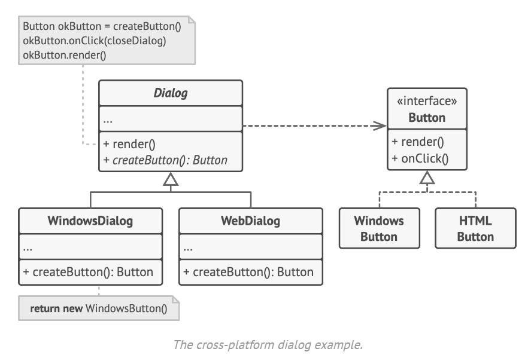
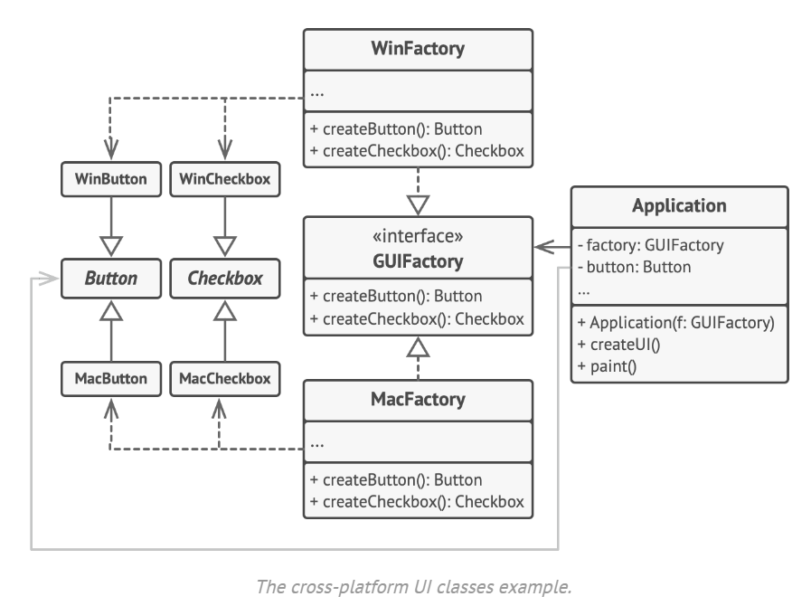
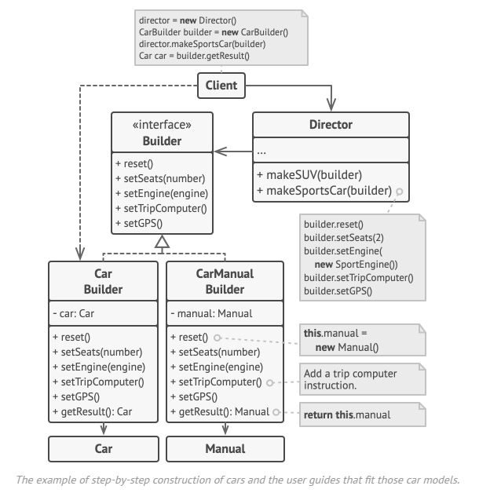
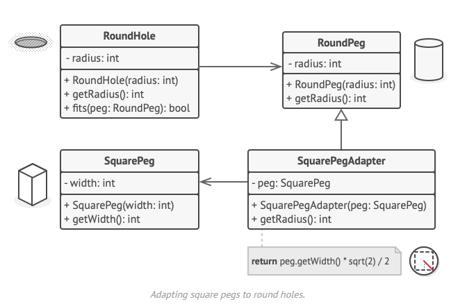

# pruebas-formacion-diseno

En este pequeño repositorio de pruebas se incluyen los diferentes patrones de diseño indicado en la página web de [Refactoring Guru](https://refactoring.guru/design-patterns)

Patrones::
 - [creational_patterns](creational_patterns)
   * [Factory Method](creational_patterns/factory_method.py)
        
   * [Abstract Factory](creational_patterns/abstract_method.py)
        
   * [Builder](creational_patterns/builder.py)
        

 - [structural_patterns](structural_patterns)
   * [Adapter](structural_patterns/adapter.py)
       